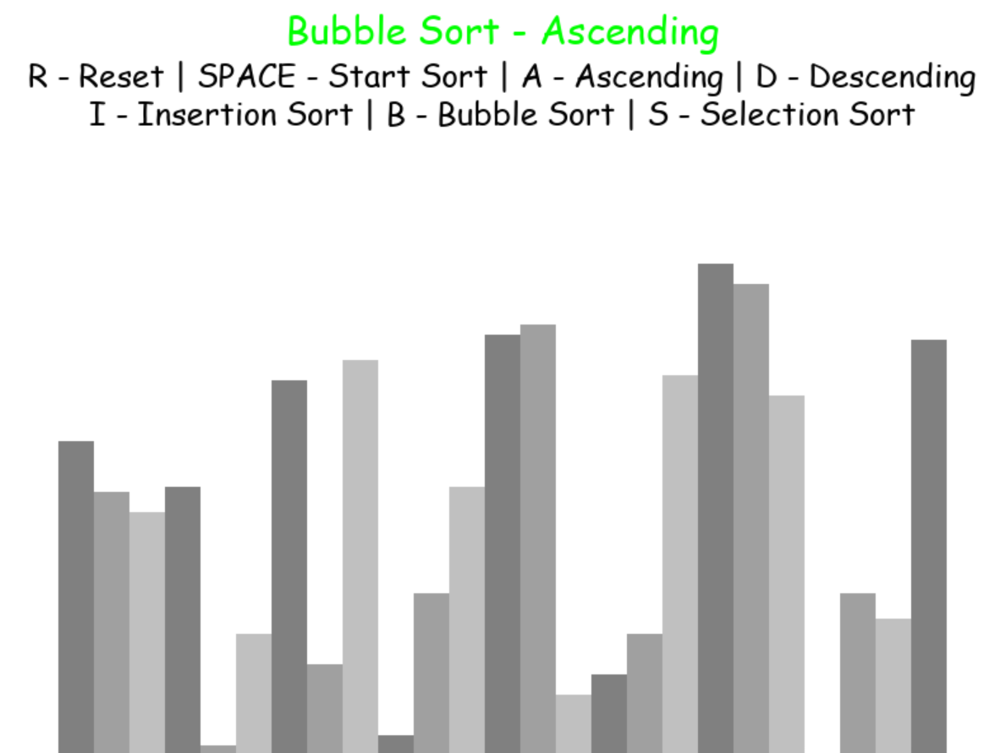
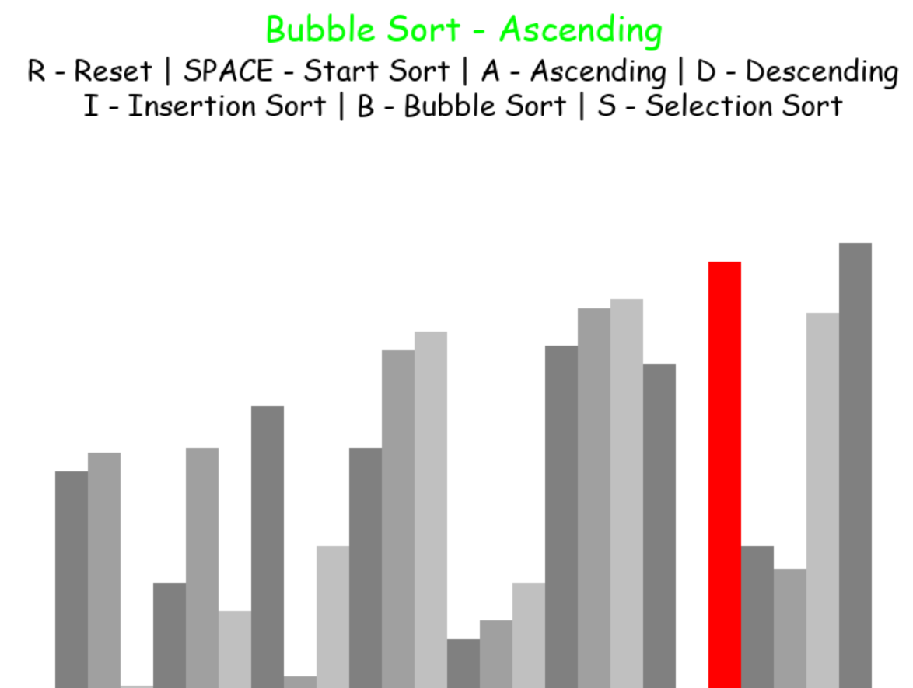
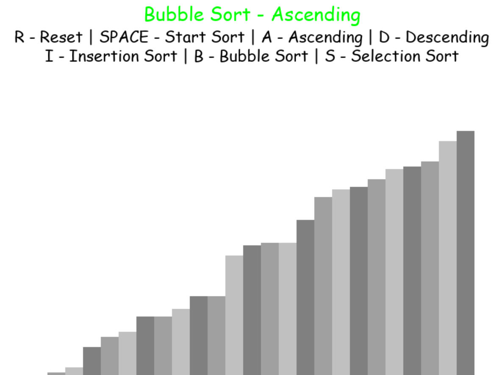
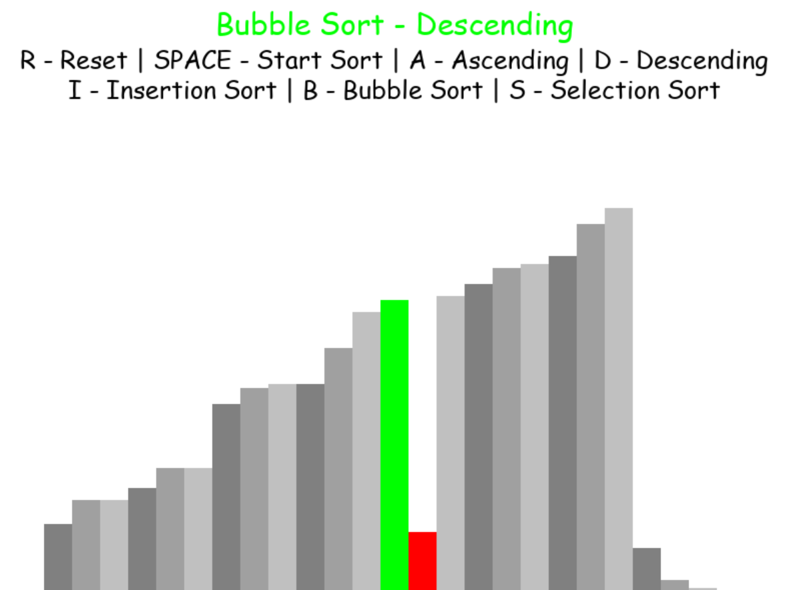
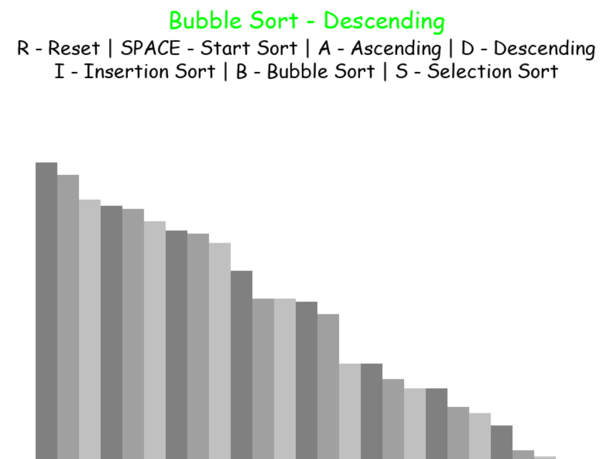

## In Place Sorting Algorithm Visualizer with Python
<em>Project is based on Tech With Tim - Python Sorting Algorithm Visualizer Tutorial</em> 
<em>The project was developed as practice and more algorithms were/being added</em>

## Overview

The project visualizes different sorting algorithms using pygame and python

Algorithms implemented:

<ul>
    <li>Bubble sort</li>
    <li>Insertion sort</li>
    <li>Selection sort</li>
</ul>

## Images

<em>Application GUI</em>

<em>During Bubble sort (ascending)</em>

<em>Sorted with Bubble sort (ascending)</em>

<em>During Bubble sort (descending)</em>

<em>Sorted with Bubble sort (descending)</em>